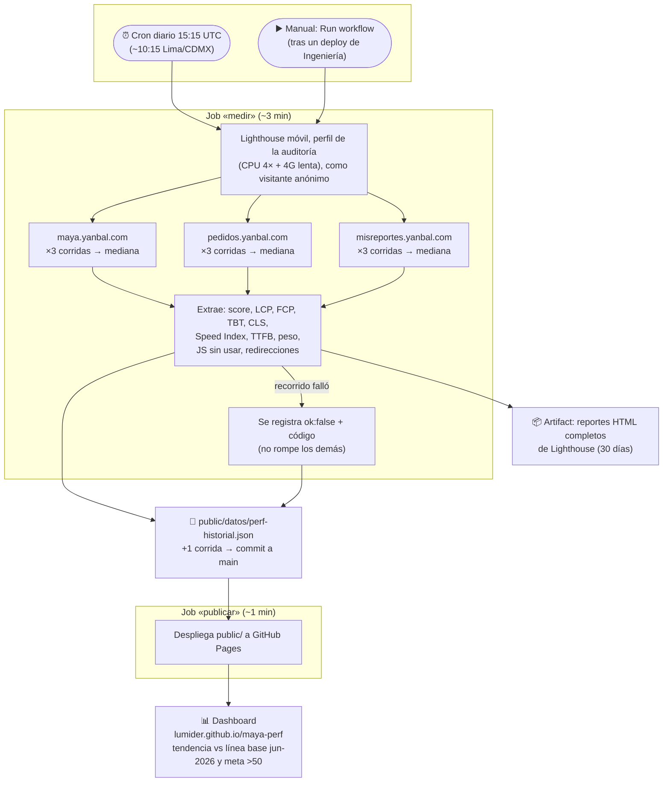

# maya-perf

Seguimiento continuo de la **Auditoría de Performance Móvil de Maya (Yanbal, jun 2026)**:
un workflow corre Lighthouse a diario contra producción, acumula el historial en el repo y
publica un dashboard estático en GitHub Pages que responde una sola pregunta:
**¿mejoramos desde la auditoría?**

**Dashboard:** https://lumider.github.io/maya-perf/

## Qué mide

Los 3 recorridos de la auditoría, con su **misma metodología** (perfil estándar de
Lighthouse móvil: CPU 4× + 4G lenta simulada — sin throttling custom, para que cada
corrida sea comparable con la línea base):

| Recorrido | URL | Línea base jun-2026 |
| --- | --- | --- |
| Ingresar a Maya | maya.yanbal.com | 37/100 · LCP 17.9 s |
| Pase de Pedido | pedidos.yanbal.com | 50/100 · LCP 15.8 s |
| Mis Reportes | misreportes.yanbal.com | 52/100 (solo el spinner) |

Metas de la auditoría: **LCP < 2.5 s** y **score > 50**. Cada punto del historial es la
**mediana de 3 corridas**. Además de las Web Vitals se registran las dos palancas P0:
**JS sin usar** y **tiempo en cadenas de redirección** de login.

La misma URL sirve a México, Perú, Bolivia y Guatemala (el país se elige dentro de la
app), así que toda mejora medida aquí aplica a los 4 mercados.

## Flujo



## Qué produce cada corrida (resultado)

Tres salidas, de más inmediata a más detallada:

**1. El dashboard** — la vista para Producto/Ingeniería: tendencia del score por recorrido
partiendo de la línea base de la auditoría, cards con deltas (vs jun-2026 y vs corrida
anterior) y métricas coloreadas por los umbrales oficiales de Lighthouse.

**2. Una entrada nueva en el historial JSON** (la "base de datos" es el propio repo).
Ejemplo real — primera corrida, 15 jul 2026:

```jsonc
{
  "fecha": "2026-07-15T17:41:03.618Z",
  "lighthouse": "12.8.2",
  "recorridos": {
    "portal":   { "ok": true, "score": 50, "fcpMs": 5942, "lcpMs": 11049, "tbtMs": 431,
                  "cls": 0, "speedIndexMs": 5942, "ttfbMs": 52, "pesoKb": 1511,
                  "jsSinUsarKb": 470, "redireccionesMs": 0 },
    "pedido":   { "ok": false, "error": "NO_FCP" },   // la página nunca pintó contenido
    "reportes": { "ok": true, "score": 56, "fcpMs": 9777, "lcpMs": 11515, "tbtMs": 10,
                  "cls": 0, "speedIndexMs": 9777, "ttfbMs": 216, "pesoKb": 2217,
                  "jsSinUsarKb": 482, "redireccionesMs": 0 }
  }
}
```

Cómo leerlo: el portal tarda **11 s en mostrar contenido** (meta: 2.5 s) descargando
**1.5 MB**, de los cuales **470 KB de JavaScript no se usan**; el servidor no es el
problema (TTFB 52 ms) — consistente con el diagnóstico de la auditoría. Y `pedido`
con `NO_FCP` es un hallazgo en sí: la entrada quedó en blanco sin pintar nada.

**3. Los reportes HTML completos de Lighthouse** como artifact del run (pestaña Actions,
30 días): el detalle auditoría por auditoría con las oportunidades de mejora concretas,
para cuando Ingeniería quiera profundizar en un punto de la tendencia.

### Limitaciones (honestidad metodológica)

- Se mide **sin sesión** (Azure AD B2C): cada recorrido captura su entrada real —
  redirecciones de login incluidas — pero no el interior post-login.
- En **Mis Reportes**, Lighthouse solo ve el spinner; el reporte SSRS real no cargó en
  >90 s en la auditoría. La meta «reporte < 5 s» requiere medición de campo.
- TBT es la métrica más ruidosa en CI: leer tendencias, no puntos sueltos.

## Estructura

```
scripts/lighthouse-maya.mjs     # runner: N corridas × recorrido, mediana, historial
public/datos/objetivos.mjs      # config compartida runner+dashboard: recorridos, metas, línea base
public/datos/perf-historial.json# historial commiteado por el workflow (tope 400 corridas)
public/index.html               # dashboard estático (GitHub Pages)
.github/workflows/perf.yml      # cron diario 15:15 UTC + manual + deploy a Pages
```

## Uso local

```bash
npm ci
npm run perf                                   # los 3 recorridos, 3 corridas c/u
npm run perf -- --recorrido portal --corridas 1  # prueba rápida
npx http-server public   # (o python3 -m http.server -d public) para ver el dashboard
```

Los reportes HTML completos de Lighthouse quedan en `reportes/` (local) y como artifact
del workflow (30 días).

## Operación

- **Cron diario 15:15 UTC** (≈ media mañana en los 4 mercados) + `workflow_dispatch` manual.
- El workflow commitea `public/datos/perf-historial.json` a `main` y despliega Pages en el
  mismo run (los pushes con `GITHUB_TOKEN` no disparan otros workflows).
- Si un recorrido falla (WAF, timeout), queda registrado como `ok: false` con su código de
  error y visible en el dashboard; el workflow solo falla si **ningún** recorrido midió.
- Para cambiar recorridos, metas o número de corridas: `public/datos/objetivos.mjs`.
