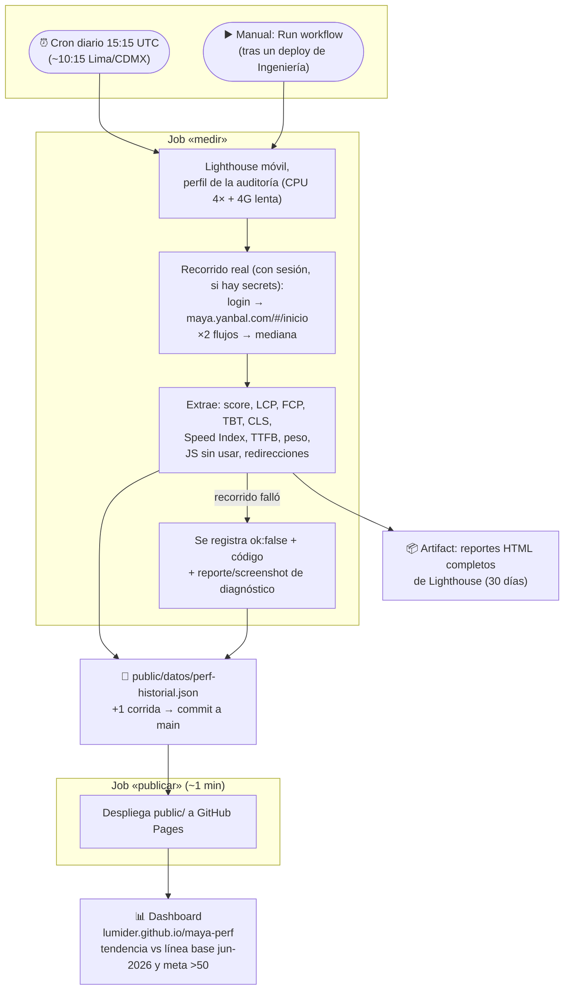

# maya-perf

Seguimiento continuo de la **Auditoría de Performance Móvil de Maya (Yanbal, jun 2026)**:
un workflow corre Lighthouse a diario contra producción, acumula el historial en el repo y
publica un dashboard estático en GitHub Pages que responde una sola pregunta:
**¿mejoramos desde la auditoría?**

**Dashboard:** https://lumider.github.io/maya-perf/

## Qué mide

Siempre con la **misma metodología de la auditoría** (perfil estándar de Lighthouse móvil:
CPU 4× + 4G lenta simulada — sin throttling custom), en dos grupos:

**Recorrido real (con sesión)** — requiere credenciales
(ver [Activar el recorrido real](#activar-el-recorrido-real-con-sesión)):

| Recorrido | Cómo se llega | Línea base jun-2026 |
| --- | --- | --- |
| Portal Maya | `maya.yanbal.com/#/inicio`, autenticado | 37/100 · LCP 17.9 s |

Por decisión de jul-2026 el seguimiento se concentra en `#/inicio`. Las derivaciones por
clic («Realizar pedido» → pedidos.yanbal.com, «Mis Reportes» → misreportes.yanbal.com,
líneas base 50 y 52) y la entrada anónima quedaron **desactivadas pero listas**: se
reactivan descomentando/añadiendo sus recorridos en `public/datos/objetivos.mjs`.

Metas de la auditoría: **LCP < 2.5 s** y **score > 50**. Cada punto del historial es la
**mediana de varias corridas**. Además de las Web Vitals se registran las dos palancas P0:
**JS sin usar** y **tiempo en cadenas de redirección** de login.

La misma URL sirve a México, Perú, Bolivia y Guatemala (el país se elige dentro de la
app), así que toda mejora medida aquí aplica a los 4 mercados.

## Flujo



## Qué produce cada corrida (resultado)

Tres salidas, de más inmediata a más detallada:

**1. El dashboard** — la vista para Producto/Ingeniería: tendencia del score por recorrido
partiendo de la línea base de la auditoría, cards con deltas (vs jun-2026 y vs corrida
anterior) y métricas coloreadas por los umbrales oficiales de Lighthouse.

**2. Una entrada nueva en el historial JSON** (la "base de datos" es el propio repo).
Forma de cada corrida (valores ilustrativos):

```jsonc
{
  "fecha": "2026-07-17T15:15:00.000Z",
  "lighthouse": "12.8.2",
  "recorridos": {
    "inicio": { "ok": true, "score": 38, "fcpMs": 6100, "lcpMs": 17200, "tbtMs": 700,
                "cls": 0.02, "speedIndexMs": 12100, "ttfbMs": 350, "pesoKb": 1600,
                "jsSinUsarKb": 2100, "redireccionesMs": 0 }
    // un recorrido que falla queda como { "ok": false, "error": "CODIGO" }
  }
}
```

Cómo leerlo contra la línea base (37/100 · LCP 17.9 s) y las metas (>50 · <2.5 s):
score y LCP dicen si mejoramos; `jsSinUsarKb` y `redireccionesMs` siguen las dos
palancas P0; `ttfbMs` separa "servidor lento" de "cliente lento".

**3. Los reportes HTML completos de Lighthouse** como artifact del run (pestaña Actions,
30 días): el detalle auditoría por auditoría con las oportunidades de mejora concretas,
para cuando Ingeniería quiera profundizar en un punto de la tendencia.

### Limitaciones (honestidad metodológica)

- Hasta activar la cuenta de prueba, solo se mide la **entrada sin sesión**; el interior
  post-login (el `#/inicio` real) espera los secrets.
- En **Mis Reportes**, Lighthouse solo ve el spinner; el reporte SSRS real no cargó en
  >90 s en la auditoría. La meta «reporte < 5 s» requiere medición de campo.
- TBT es la métrica más ruidosa en CI: leer tendencias, no puntos sueltos.

## Activar el recorrido real (con sesión)

1. Pedir una **cuenta de prueba** de Maya (con el equipo de seguridad de Yanbal; idealmente
   exenta de MFA/captcha y con datos ficticios). **Nunca usar una cuenta personal de
   producción**: sus credenciales correrían en un CI y sus datos aparecerían en los reportes.
2. En el repo: **Settings → Secrets and variables → Actions → New repository secret**, crear
   `MAYA_USUARIO` y `MAYA_CLAVE` con las credenciales.
3. Disparar el workflow (Actions → Perf Lighthouse → Run workflow). Desde entonces el cron
   diario mide también este grupo, y el dashboard muestra los deltas vs la auditoría.
4. Si el login automatizado falla (formulario B2C distinto a los selectores por defecto),
   el error queda en el historial y hay screenshot en el artifact — se ajustan los
   selectores en `public/datos/objetivos.mjs` (`SESION.selectores`). Una iteración de
   ajuste en la primera activación es esperable.
5. Al activar, reevaluar si el repo debería pasar a **privado** (las métricas pasarían a
   describir pantallas internas).

## Estructura

```
scripts/lighthouse-maya.mjs     # runner de la entrada anónima: N corridas, mediana
scripts/flujo-sesion.mjs        # recorrido real con sesión (Lighthouse user flows)
scripts/metricas.mjs            # extracción de métricas + historial (compartido)
public/datos/objetivos.mjs      # config compartida runner+dashboard: recorridos, metas, línea base
public/datos/perf-historial.json# historial commiteado por el workflow (tope 400 corridas)
public/index.html               # dashboard estático (GitHub Pages)
.github/workflows/perf.yml      # cron diario 15:15 UTC + manual + deploy a Pages
```

## Uso local

```bash
npm ci
npm run perf                                     # entrada anónima: 3 recorridos × 3 corridas
npm run perf -- --recorrido portal --corridas 1  # prueba rápida
MAYA_USUARIO=u MAYA_CLAVE=c npm run perf:sesion  # recorrido real (requiere credenciales)
npx http-server public   # (o python3 -m http.server -d public) para ver el dashboard
```

Los reportes HTML completos de Lighthouse quedan en `reportes/` (local) y como artifact
del workflow (30 días); los recorridos fallidos dejan `reportes/<codigo>-fallo.*` para
diagnóstico.

## Operación

- **Cron diario 15:15 UTC** (≈ media mañana en los 4 mercados) + `workflow_dispatch` manual.
- El workflow commitea `public/datos/perf-historial.json` a `main` y despliega Pages en el
  mismo run (los pushes con `GITHUB_TOKEN` no disparan otros workflows).
- Si un recorrido falla (WAF, timeout), queda registrado como `ok: false` con su código de
  error y visible en el dashboard; el workflow solo falla si **ningún** recorrido midió.
- Para cambiar recorridos, metas o número de corridas: `public/datos/objetivos.mjs`.
